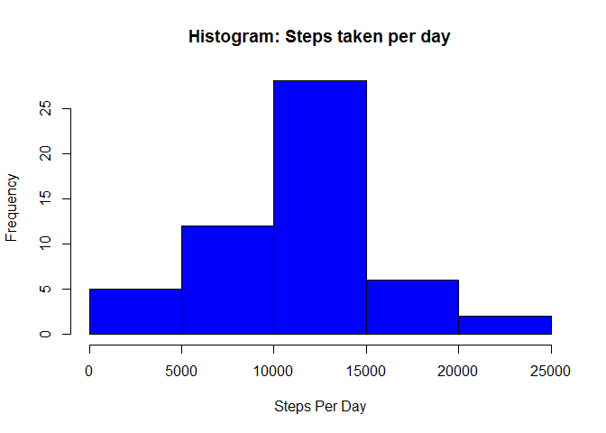
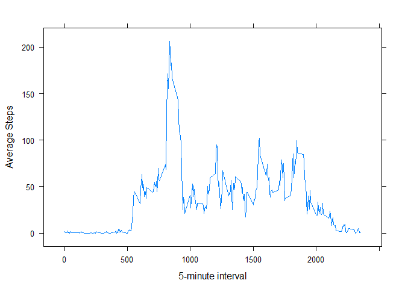
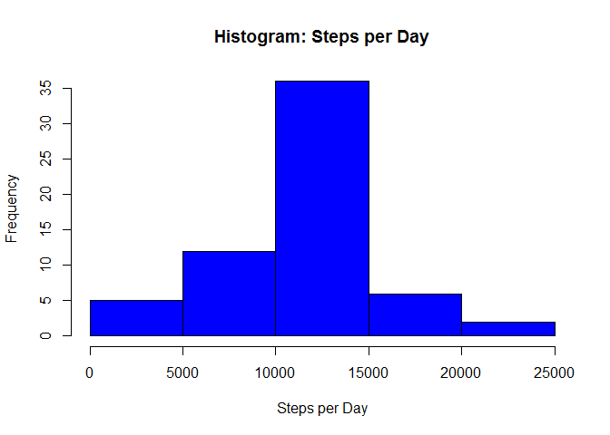

# Reproducible Research: Peer Assessment 1

## Loading and preprocessing the data

- Fetch the data from zip file activity.csv:


```r
data <- read.table(unz("activity.zip", "activity.csv"), header=T, sep=",")
```

- Display top 5 rows of the data using the head() function to endure the data is loaded correctly:


```r
head(data,5)
```

```
##   steps       date interval
## 1    NA 2012-10-01        0
## 2    NA 2012-10-01        5
## 3    NA 2012-10-01       10
## 4    NA 2012-10-01       15
## 5    NA 2012-10-01       20
```

## What is mean total number of steps taken per day?

- Calculate the total number of steps taken per day:


```r
aggPerDay <- aggregate(cbind(steps)~date, sum,data=data, na.rm = TRUE)
colnames(aggPerDay) <- c("date","steps")
```

- Make a Histogram of the total number of steps taken each day:


```r
hist(aggPerDay$steps,xlab = "Steps Per Day", main = "Histogram: Steps taken per day", col = "blue")
```

 

- Calculate the mean and median of the total number of steps taken per day:


```r
aggPerDay.mean <- mean(aggPerDay$steps)
aggPerDay.median <- median(aggPerDay$steps)
```

Display the calculated mean:

```r
print(aggPerDay.mean)
```

```
## [1] 10766.19
```

Display the calculated median:

```r
print(aggPerDay.median)
```

```
## [1] 10765
```

## What is the average daily activity pattern?

- Make a time series plot (i.e. type = "l") of the 5-minute interval (x-axis) and the average number of steps taken, averaged across all days (y-axis):

    

```r
## Compute average steps:
averageSteps <- aggregate(data$steps,by = list(data$interval),mean,na.rm = TRUE) 
colnames(averageSteps) <- c("interval","steps")
library(lattice)
## plot the graph: 
xyplot(steps~interval,data = averageSteps,type = "l",xlab = "5-minute interval", ylab = "Average Steps") 
```

 
                          
- Which 5-minute interval, on average across all the days in the dataset, contains the maximum number of steps?


```r
##5-minute interval with maxium average steps across all the days: 
averageSteps[averageSteps$steps == max(averageSteps$steps),]$interval
```

```
## [1] 835
```

4. Imputing missing values

- Calculate and report the total number of missing values in the dataset (i.e. the total number of rows with NAs)


```r
length(data[is.na(data$steps),]$step)
```

```
## [1] 2304
```


```r
temp <- data.frame(stepsToFill = averageSteps[match(data$interval,averageSteps$interval),2])
##Create New Data Frame with no NAs (by replacing with mean for specific interval):
dataNew <- data.frame(data)
dataNew$steps[which(is.na(dataNew$steps))] <- temp$steps[which(is.na(dataNew$steps))] 
##Check for NAs in the new Data Frame:
length(dataNew[is.na(dataNew$steps),]$step) 
```

```
## [1] 0
```
- Make a histogram of the total number of steps taken each day and Calculate and report the mean and median total number of steps taken per day. Do these values differ from the estimates from the first part of the assignment? What is the impact of imputing missing data on the estimates of the total daily number of steps?

- New histogram of the total number of steps taken each day after imuting missing values:

```r
##Create a new data frame with steps taken per day
totalSteps <- aggregate(dataNew$steps , by = list(dataNew$date),sum,na.rm = TRUE)
colnames(totalSteps) <- c("date","steps")
hist(totalSteps$steps,xlab = "Steps per Day", main = "Histogram: Steps per Day", col = "blue")
```

 

- Calculate the new mean and median of total number of steps taken per day: 

```r
mean <- mean(totalSteps$steps,na.rm = TRUE)
median <- median(totalSteps$steps,na.rm = TRUE)
```

- Display the new calculated mean:


```r
##Print Mean:
print(mean)
```

```
## [1] 10766.19
```

- Display the new calculated median:


```r
##Print Median:
print(median)
```

```
## [1] 10766.19
```

Observaion: Even though the mean did not change, the median did change slightly. Also, after replacing the NAs with the means for specific interval, the mean and median have become equal.

## Are there differences in activity patterns between weekdays and weekends?

- Create a new factor variable in the dataset with two levels - "weekday"
and "weekend" indicating whether a given date is a weekday or weekend
day.


```r
##Add partOfWeek column to the table
xdata <- character(nrow(dataNew))
xdata[] <- "weekday"
partOfWeek <- factor(xdata,levels=c("weekday","weekend"))
dataNew$partOfWeek <- factor(xdata,levels=c("weekday","weekend"))
dataNew[weekdays(as.Date(data$date))%in% c("Saturday","Sunday"),4] <- "weekend"
##Find the mean of steps per interval and part of week
averageSteps2 <- aggregate(dataNew$steps,by = list(dataNew$interval,dataNew$partOfWeek),mean,na.rm = TRUE)
```

- Make a panel plot containing a time series plot (i.e. type = "l") of the
5-minute interval (x-axis) and the average number of steps taken, averaged
across all weekday days or weekend days (y-axis).

```r
colnames(averageSteps2) <- c("interval","partOfWeek","steps")
library(ggplot2)
```

```
## Warning: package 'ggplot2' was built under R version 3.2.1
```

```r
g <- ggplot(averageSteps2,aes(interval,steps))
g + geom_line() + facet_grid(partOfWeek~.)
```

 
